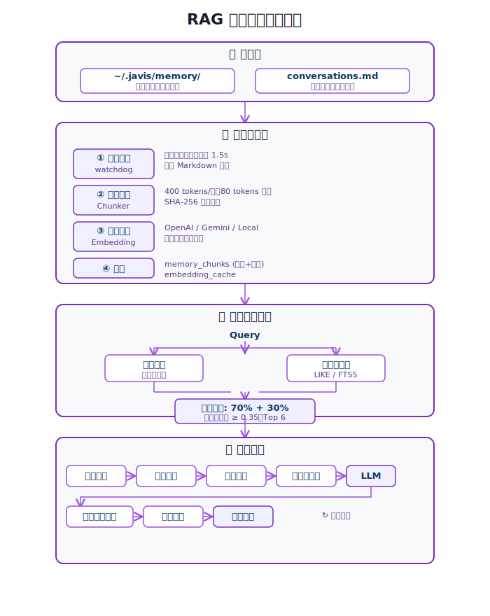

<div align="center">

  # Javis Memory

  ### **带 RAG 记忆的个人 AI 助手系统**

  [](https://fastapi.tiangolo.com)
  [](https://www.python.org)
  [](LICENSE)

  一个基于 FastAPI 的 AI 助手，通过 **RAG 向量检索记忆系统** 自动管理对话上下文，让 AI "记住"之前的对话并提供个性化回复。

</div>

---

## ✨ 核心特性

| 特性 | 说明 |
| :--- | :--- |
| **🧠 RAG 记忆系统** | 向量检索 + 关键词搜索的混合记忆，智能关联历史对话 |
| **🔄 LLM 代理** | 多服务器负载均衡，支持 OpenAI / DeepSeek / 豆包 / 通义千问 / 智谱 / Ollama |
| **📂 自动同步** | 文件监控自动更新记忆索引，实时生效 |
| **⚡ 流式传输** | SSE 实时流式响应，低延迟体验 |
| **🔑 API Key 认证** | 可选的用户认证系统，支持速率限制 |
| **🛡️ 优雅降级** | 数据库异常时自动降级，不影响核心功能 |

---

## 📁 项目结构

```
javis/
├── api/                        # API 层
│   ├── routes/
│   │   ├── chat.py            # 聊天完成接口（集成 RAG）
│   │   ├── memory.py          # 记忆搜索接口
│   │   └── api_keys.py        # API Key 管理
│   ├── main.py                # FastAPI 应用入口
│   └── middleware.py          # 日志中间件
│
├── services/                   # 业务服务层
│   ├── llm_forwarder.py       # LLM 请求转发（负载均衡）
│   ├── memory_index.py        # 记忆索引管理器
│   ├── search_engine.py       # 混合搜索引擎
│   ├── chunker.py             # 文本分块服务
│   ├── file_watcher.py        # 文件监控服务
│   ├── conversation.py        # 对话管理
│   ├── auth.py                # 认证服务
│   └── embedding/             # 嵌入服务
│       ├── factory.py         # 提供者工厂
│       ├── openai_client.py   # OpenAI 兼容 API
│       ├── gemini_client.py   # Gemini API
│       └── local_client.py    # 本地 sentence-transformers
│
├── database/                   # 数据持久层
│   ├── models.py              # 用户/对话/消息模型
│   ├── memory_models.py       # RAG 记忆模型
│   ├── session.py             # 异步会话管理
│   └── repository.py          # 数据访问层
│
├── config/
│   ├── settings.py            # Pydantic 配置模型
│   └── servers.yaml           # 主配置文件
│
├── schemas/                    # API 数据模型
│   ├── chat.py                # 聊天相关模型
│   └── memory_search.py       # 记忆搜索模型
│
├── run.py                      # 启动脚本
├── setup.py                    # 自动化配置向导
└── init_db.py                  # 数据库初始化
```

---

## 🚀 快速开始

### 环境要求

- **Python** 3.10 或更高版本

### 方式一：自动化配置（推荐）

一键完成依赖安装、配置文件生成和数据库初始化：

```bash
python setup.py
```

交互式向导会引导你：
- 选择 LLM 服务商
  - OpenAI / DeepSeek / 豆包 / 通义千问 / 智谱 / Ollama / 自定义
- 配置嵌入服务（用于记忆系统）
- 创建默认用户和 API Key

完成后启动服务：

```bash
python run.py
```

---

### 方式二：手动配置

```bash
# 1. 安装依赖
pip install -r requirements.txt

# 2. 复制配置文件
cp config/servers.example.yaml config/servers.yaml

# 3. 编辑 config/servers.yaml，填入你的 API Key

# 4. 初始化数据库
python init_db.py

# 5. 启动服务
python run.py
```

---

### 访问服务

服务启动后：

| 服务 | 地址 |
| :--- | :--- |
| **API 服务** | `http://localhost:8000` |
| **交互式文档** | `http://localhost:8000/docs` |
| **ReDoc 文档** | `http://localhost:8000/redoc` |

---

## 🧠 RAG 记忆系统原理

### 工作流程

<div align="center">

  

</div>

<!-- 图表说明：RAG 记忆系统从数据源收集信息，经过索引流水线处理（文件监控、分块、嵌入、存储），然后通过混合搜索引擎（向量+关键词）检索相关记忆，最终在对话中应用 -->

### 混合检索算法

```python
# 伪代码示例
def hybrid_search(query: str, top_k: int = 6) -> List[Document]:
    # 1. 向量搜索：计算余弦相似度
    query_embedding = embed(query)
    vector_scores = cosine_similarity(query_embedding, doc_embeddings)

    # 2. 关键词搜索：文本匹配
    keyword_scores = text_match(query, doc_texts)

    # 3. 结果融合
    results = []
    for doc in all_candidates:
        score = (
            0.7 * normalize(vector_scores[doc]) +
            0.3 * normalize(keyword_scores[doc])
        )
        if score >= 0.35:  # 最小相关度阈值
            results.append((doc, score))

    return sorted(results, key=lambda x: x[1], reverse=True)[:top_k]
```

---

## 📖 API 示例

### 聊天完成（启用记忆）

```bash
curl -X POST http://localhost:8000/v1/chat/completions \
  -H "Content-Type: application/json" \
  -d '{
    "model": "deepseek-chat",
    "messages": [
      {"role": "user", "content": "你好，还记得我上次说什么吗？"}
    ],
    "enable_profile": true,
    "stream": false
  }'
```

**响应示例：**
```json
{
  "id": "chatcmpl-123",
  "object": "chat.completion",
  "choices": [{
    "message": {
      "role": "assistant",
      "content": "你好！根据我们的对话记录，你之前提到了..."
    }
  }]
}
```

### 搜索记忆

```bash
curl -X POST "http://localhost:8000/v1/memory/search?user_id=1" \
  -H "Content-Type: application/json" \
  -d '{
    "query": "之前讨论过什么话题",
    "max_results": 5
  }'
```

### 其他接口

| 方法 | 路径 | 说明 |
| :--- | :--- | :--- |
| `GET` | `/v1/models` | 获取可用模型列表 |
| `POST` | `/v1/memory/sync` | 手动触发记忆同步 |
| `GET` | `/v1/memory/status` | 查看记忆系统状态 |
| `GET` | `/v1/memory/file` | 读取记忆文件内容 |

---

## ⚙️ 配置说明

主要配置位于 `config/servers.yaml`：

### LLM 服务器配置

```yaml
servers:
  deepseek:
    base_url: https://api.deepseek.com/v1
    api_key: sk-your-api-key
    models:
      - deepseek-chat
      - deepseek-reasoner
```

### 记忆系统配置

| 配置项 | 默认值 | 说明 |
| :--- | :--- | :--- |
| `memory_search.enabled` | `true` | 是否启用记忆系统 |
| `memory_search.provider` | `auto` | 嵌入提供者：`openai` / `gemini` / `local` / `auto` |
| `memory_search.chunking.tokens` | `400` | 分块 token 数量 |
| `memory_search.chunking.overlap` | `80` | 分块重叠 token 数 |
| `memory_search.query.max_results` | `6` | 搜索最大返回结果数 |
| `memory_search.query.min_score` | `0.35` | 最小相关度分数阈值 |
| `memory_search.query.hybrid.vector_weight` | `0.7` | 向量搜索权重 |
| `memory_search.query.hybrid.text_weight` | `0.3` | 关键词搜索权重 |
| `memory_search.sync.watch` | `true` | 是否启用文件监控自动同步 |
| `memory_search.sync.watch_debounce_ms` | `1500` | 文件变化防抖延迟（毫秒） |

---

## 🔧 技术栈

| 组件 | 技术选型 | 说明 |
| :--- | :--- | :--- |
| **Web 框架** | FastAPI + uvicorn | 现代异步 Python Web 框架 |
| **数据库 ORM** | SQLAlchemy 2.0 + aiosqlite | 异步 ORM，SQLite 存储 |
| **向量搜索** | 手动实现 / sqlite-vec | 余弦相似度计算 |
| **全文搜索** | SQLite LIKE / FTS5 | 可选 FTS5 全文索引 |
| **HTTP 客户端** | httpx | 支持 HTTP/2、连接池、重试 |
| **文件监控** | watchdog | 跨平台文件系统事件 |
| **配置管理** | YAML + Pydantic | 类型安全的配置解析 |
| **嵌入模型** | OpenAI / Gemini / Local | 支持多种嵌入服务 |

---

## 📝 许可证

MIT License

---

<div align="center">

  **Made with ❤️ by [Your Name]**

  [⭐ Star this repo](../../stargazers) · [🐛 Report a bug](../../issues) · [📖 Request a feature](../../issues)

</div>
